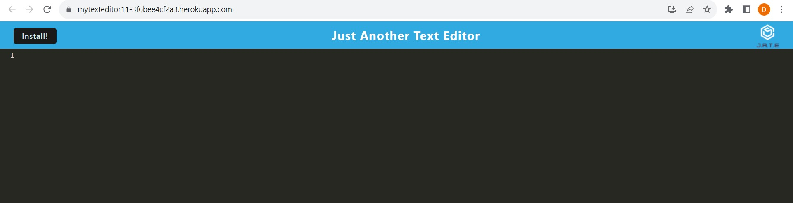

# MyTextEditorApp1.0

## **MyTextEditorApp1.0: Just Another Text Editor

The code outlines a Progressive Web App (PWA) text editor that leverages the CodeMirror library for editing, saves content to IndexedDB for persistent storage, provides offline capabilities using Workbox and service workers, and is hosted on an Express.js server.

---
#### **Tech Stack:**

1. **CodeMirror**: An in-browser text/code editor library.
2. **IndexedDB** with the **idb** wrapper: A browser-based database system for structured data storage.
3. **Workbox**: A library for handling service workers and caching in Progressive Web Apps (PWAs).
4. **Express.js**: A web server framework for Node.js.
5. **JavaScript**: Used for client-side logic, service workers, and server-side scripting with Node.js.

#### **Features:**

1. **Text Editing**:
   - Utilizes the CodeMirror library for an enriched text editing experience.
   - Supports syntax highlighting for JavaScript, line numbers, line wrapping, and a specific theme (monokai).
   
2. **Data Persistence**:
   - Saves content locally in the browser using both `localStorage` for quick access and IndexedDB for long-term storage.
   - Asynchronous operations for data retrieval and saving to IndexedDB.
   
3. **Offline Support**:
   - Uses Workbox for service worker registration, routing, and caching strategies, making the app usable offline.
   - Precaches assets to ensure immediate availability offline.
   - Implements a Cache-First strategy for HTML pages to optimize load times and offline availability.
   
4. **PWA Installability**:
   - Offers a user prompt to install the application on their device, enhancing user engagement.
   
5. **Express.js Backend**:
   - Serves the main `index.html` file to the client.
   - Hosts static files for the application.
   
6. **Real-time Auto-saving**:
   - Content in the editor is saved to `localStorage` in real-time as changes are made.
   
7. **Editor Blur Save Event**:
   - When the editor loses focus, content is persisted to IndexedDB for more durable storage.

8. **Initialization and Error Handling**:
   - Checks for the presence of CodeMirror before initialization.
   - Initial content loading prioritizes IndexedDB, then `localStorage`, and finally falls back to a predefined header if no data is found.

  ## Table of Contents
  - [Installation](#installation)
  - [Usage](#usage)
  - [Packages Used](#package-list)
  - [Deployed Link](#deployed-link)
  - [Sample Application](#sample-application)
  - [License](#license)
  - [Questions](#questions)
  ## Installation 

1. **Visit the Web Application**: Users initially visit the text editor application through their web browser.

    https://mytexteditor11-3f6bee4cf2a3.herokuapp.com/

2. **Triggering the Install Prompt**: 
   - After certain criteria are met (like visiting the app a few times or interacting for a specific duration), the browser fires the `beforeinstallprompt` event.
   - When this event is triggered, the "Install" button becomes visible to the user.

3. **User Initiates Installation**:
   - The user clicks on the "Install" button.
   - The application then shows the actual browser-native installation prompt using `promptEvent.prompt()`, where the user gets an option to add the app to their home screen or install it on their device.

4. **Application Installation**:
   - If the user agrees, the application gets added to their device's home screen (on mobile) or might be installed as a standalone app (on desktops, depending on the browser and OS). This allows users to access the app just like any other native application, but it's still technically a web app.

5. **Post-Installation**:
   - Once installed, the `appinstalled` event is triggered. At this point, the code ensures the deferred installation prompt won't be shown again by setting `window.deferredPrompt` to null.
   - The "Install" button is also hidden post-installation to prevent redundancy.

To install this on your development machine or a server, additional steps would be needed, including setting up a development environment, installing dependencies, and starting the Express.js server. But from a user perspective, the above steps capture the installation process of the PWA.

## Usage 

1. **Accessing the Editor**:
   - The user navigates to the web application's URL through a web browser.
   - If the application was installed as a PWA, the user can also open it directly from their device's home screen or applications list.

2. **Text Editing**:
   - Upon opening, the user sees a CodeMirror-enhanced text editor with features like syntax highlighting, line numbers, and line wrapping.
   - The editor supports JavaScript syntax out-of-the-box, but this can be extended with other languages if required.

3. **Auto-Saving**:
   - As the user types or modifies content in the editor, changes are automatically saved to `localStorage`, ensuring no data loss in case the browser tab is closed unexpectedly.

4. **Long-Term Saving**:
   - When the editor loses focus (e.g., the user clicks outside the editor or switches tabs), the current content is saved to IndexedDB. This provides more durable and long-term storage than `localStorage`.

5. **Loading Previous Work**:
   - The next time the user visits the application or reopens it, the content is loaded from IndexedDB. If nothing is found in IndexedDB, the application checks `localStorage`. If neither storage method has content, a predefined header is loaded as the default content.

6. **Offline Capabilities**:
   - Thanks to the service workers and caching strategies implemented using Workbox, users can continue to edit and save their work even when offline. Changes will be persisted locally and can be synchronized or retrieved when back online.

7. **Installation**:
   - If the application identifies it as installable and the criteria are met, an "Install" button becomes visible to users. Clicking this allows the web app to be installed on their device as a PWA for easy access without the need for a browser address bar.

Throughout their usage, users benefit from a seamless text editing experience that intelligently manages data storage, offers offline capabilities, and provides the convenience of a native-like application if they choose to install it.

## Packages Used 

From the provided code snippets, the following packages and libraries are identified:

1. **Express**: A fast, unopinionated, and minimalist web framework for Node.js. It's used to serve static files and handle routes on the server side.
   
2. **CodeMirror**: A versatile text editor implemented in JavaScript for browsers. It specializes in editing code and includes features like syntax highlighting and more. In the given code, it's used as the core of the text editor.

3. **Workbox**: A set of libraries that make it easy to cache assets and take full advantage of features used to build PWAs. The code makes use of several Workbox modules:
   - `workbox-recipes`: Contains reusable service worker recipes.
   - `workbox-strategies`: Provides caching strategies like CacheFirst.
   - `workbox-routing`: Used to define routes for your service worker.
   - `workbox-cacheable-response`: Defines what responses are cacheable.
   - `workbox-expiration`: Helps with setting expiration policies for caches.
   - `workbox-precaching`: Manages and revives precached requests.

4. **idb**: A library that offers a promise-based interface to IndexedDB, which provides a way to store large sets of structured data (including files/blobs) client-side. It's used to store and retrieve the content of the text editor.

5. **path (Node.js module)**: Provides utilities for working with file and directory paths. In the context, it's used to serve the `index.html` file.

6. **localStorage**: Not a package per se, but a web API that allows websites to store data as key-value pairs in a web browser. It's used for quick and temporary storage of the editor's content.

7. **Babel Packages**:
   - `@babel/core`: Core functionality of Babel, a JavaScript compiler.
   - `@babel/plugin-transform-runtime`: Helps to avoid duplication in the compiled output.
   - `@babel/plugin-proposal-object-rest-spread`: Allows the use of object rest and spread properties.
   - `@babel/preset-env`: Smart defaults for Babel.
   - `@babel/runtime`: Runtime functions for compiled output.

8. **Webpack Packages**:
   - `webpack`: A static module bundler.
   - `webpack-cli`: Command line interface for Webpack.
   - `webpack-dev-server`: Provides a development server for Webpack.
   - `webpack-pwa-manifest`: Generates a manifest for Progressive Web Apps.
   - `workbox-webpack-plugin`: Integrates Workbox into Webpack; useful for service worker generation.
   - `html-webpack-plugin`: Simplifies HTML files creation that includes your webpack bundles.
   - `babel-loader`: Allows transpiling JavaScript files using Babel and Webpack.
   - `css-loader`: Resolves CSS imports for Webpack.
   - `style-loader`: Injects styles into the DOM.

## Deployed Link 

Heroku Application: https://mytexteditor11-3f6bee4cf2a3.herokuapp.com/

## Sample Application 

  
    
  
  
  
  
  
## License 
  This project is licensed under the MIT license.
  https://opensource.org/licenses/MIT

## Questions 
If you have any questions, please contact me at arun@arun.com.

My GitHub profile is [arundvp](https://github.com/arundvp).